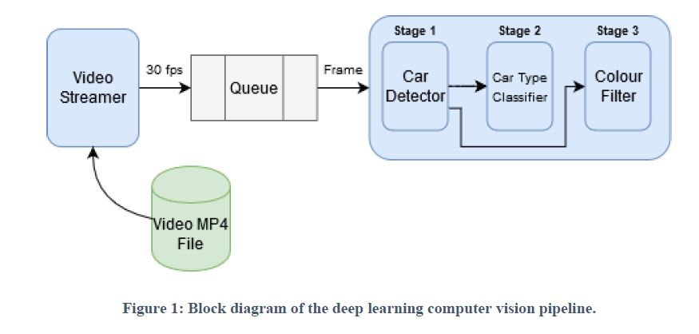

# Computer-Vision-Pipeline-for-Object-Detection-and-Classification

### 1.Introduction 

This project is the design and implementation of a deep learning computer vision pipeline in Python for detecting cars in a streamed video and classifying the type (sedan or hatchback) and colour of each car.

### 2.Design Overview

### 3.Code Details

#### 1	Files:
*pipeline.py – The python script for the pipeline
*Output_video.mp4 – This is the annotated output video of the pipeline in 5fps
*train_car_type_classifier.py – The python script used to train the classifier to predict sedan or hatchback using transfer learning
*query_f1_scores.py – This can be run after pipeline.py to print f1 scores and plot graphs without needing to re-run the pipeline
*BingAPI.py – This script was used to scrape the sedan/hatchback image data from Bing
*mobilenet_cars.h5 – This file needs to be generated by running the classifier program
*training_data/ – This directory contains the training data used for the car type classifier
*results.csv – This is the output CSV file containing the model predictions
*video.mp4 – This is the input video from the pipeline
*font/ - This directory contains files required for adding video annotations.
*keras-yolo3-master/ - This directory contains the code for YOLO. See further details below.
#### 2	Versions:
*Python Version: 3.7.4
Installations:
*pip install tensorflow==1.15
*pip install keras==2.1.5
#### 3	Run command:
python pipeline.py <query>
Where <query> can be either Q1 , Q2 or Q3
Note that the query can be changed during run time by holding down either the 1, 2 or 3 key for a couple of seconds. The changes will be seen in the terminal when a car is in the current frame.
#### 4	Notes about pipeline output:
The predictions get stored in results.csv when the pipeline is run for Q3
The videos to accompany the submission are in the output_videos directory
-	There are 2 videos, one is 5fps and the other is 30fps.
-	Both were included because 30fps is the streaming frame rate and 5fps is roughly the processing rate of the pipeline
#### 5	Further Details:
Cloned YOLO code from: https://github.com/qqwweee/keras-yolo3
Downloaded the Tiny YOLO weights at: https://pjreddie.com/media/files/yolov3-tiny.weights
Converted the following to create the Tiny YOLO weights to the correct format:
cd keras-yolo3-master
python convert.py yolov3-tiny.cfg yolov3-tiny.weights model_data/tiny_yolo.h5
 
Made changes to: keras-yolo3-master/yolo.py
Changed detect_image() method to return information about the bounding box

#### 6	Details about Bing image data scraping script:
BING API: https://gist.github.com/stivens13
Use Bing Image Search API to get the API keys
To register for the Bing Image Search API, click the “Get API Key” button
If No have requests installed(To work with HTTP Requests)
pip install requests
Run BingAPI.py with API Keys mentioned under  Ocp-Apim-Subscription-Key.

